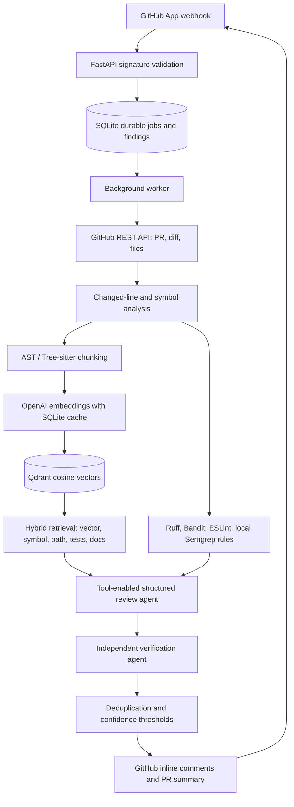

# GitHub PR Review Agent

An evidence-grounded pull request review service. It indexes repository code into Qdrant, retrieves code and project conventions for each changed symbol, combines that evidence with deterministic static analysis, and sends structured findings through independent review and verification stages before publishing a GitHub review.

This is a backend-first project. It does not claim an AI review when an LLM is unavailable: the local fixture command still demonstrates parsing, chunking, vector indexing, retrieval, and static analysis without GitHub or OpenAI credentials.

## Architecture



## What is implemented

- HMAC-SHA256 webhook verification, bounded payloads, supported pull-request actions, and idempotent `(PR, head SHA)` job creation.
- A separate durable SQLite job worker. Webhook requests return `202`; model and GitHub work happens outside the request.
- GitHub App JWT and installation-token authentication, authoritative PR/diff retrieval, archive-based initial indexing, and bounded incremental changed-file indexing.
- Python AST and Tree-sitter declaration parsing, parent/import-aware chunks, Markdown section chunking, generated/binary/lock-file exclusions, and content-addressed embeddings.
- Qdrant cosine vector search with repository/commit payload filters, plus lexical, symbol, path, documentation, and test signals. A bounded context builder prevents whole-repository prompts.
- Cached OpenAI embeddings, configurable model/context/confidence settings, and explicit timeouts/retries.
- Ruff, Bandit, ESLint, and repository-independent local Semgrep rules where tools are installed. Repository configuration files are not loaded by these analyzers.
- Tool-enabled OpenAI review, Pydantic-validated JSON, a separate verifier, changed-line validation, semantic finding deduplication, and summary/inline confidence thresholds.
- GitHub review publishing with valid added-line comments and commit-scoped idempotency marker.
- SQLite persistence for repositories, PRs, jobs, findings, embedding cache, index snapshots, and stage metrics; `/health`, `/metrics`, `/repositories`, and `/reviews/{job_id}` endpoints.
- CLI indexing, GitHub PR review, offline fixture RAG, and labeled precision/recall evaluation.

## Requirements and local setup

Use Python 3.12+, a running Qdrant instance, and an OpenAI-compatible API key for LLM/hosted embedding stages.

```powershell
py -3.12 -m venv .venv
.\.venv\Scripts\Activate.ps1
python -m pip install --upgrade pip
python -m pip install -e ".[dev]"
Copy-Item .env.example .env
```

Set `OPENAI_API_KEY` and the GitHub App settings in `.env`. Do not commit `.env` or the private key. Start Qdrant and the API/worker:

```powershell
docker compose up --build
```

The API is at `http://localhost:8000`; interactive API docs are at `/docs`. SQLite data is written under `data/` locally and the named Docker volume in Compose. The worker shares the same database and processes queued jobs.

Useful local checks and the no-GitHub demo:

```powershell
pytest
ruff check app tests evaluation
python -m app.cli review-fixture fixtures/python_project
```

With no OpenAI key the fixture command accurately reports that it ran repository indexing, vector retrieval, and available static analyzers only. Add `OPENAI_API_KEY` to exercise the review and independent verifier agents. The fixture uses deterministic local feature-hash embeddings only for an offline demonstration; production indexing defaults to the configured OpenAI embedding model.

## GitHub App setup

1. In GitHub, create a **GitHub App**. Enable **Pull requests: Read and write**, **Contents: Read**, and repository **Metadata: Read**. No organization-wide or administrator permissions are needed.
2. Subscribe to the `pull_request` webhook event. Configure a random webhook secret and set the same value as `GITHUB_WEBHOOK_SECRET`.
3. Generate and securely store the App's private key. Set `GITHUB_APP_ID` and `GITHUB_PRIVATE_KEY_PATH` to the App ID and key file path.
4. Install the App on a test repository (or select specific repositories during installation). Repository access is constrained by the installation token.
5. For local delivery, expose port 8000 with [ngrok](https://ngrok.com/) or another HTTPS tunnel, then set the App's webhook URL to `https://<your-tunnel>/webhooks/github`.
6. Set `OPENAI_API_KEY`, `LLM_MODEL`, `EMBEDDING_MODEL`, and `QDRANT_URL`; start the API and worker with `docker compose up --build`.
7. Open or update a test PR. The webhook returns `202`, the worker fetches the actual PR/diff, indexes/retrieves repository context, reviews and verifies candidates, stores results, then posts a `COMMENT` review.

For Docker, put the PEM file at `secrets/github-app.pem` (the `secrets/` directory is mounted read-only into the containers). Do not put the key in an image, source control, or logs. Supply the remaining environment variables through the invoking shell or a local `.env`; Compose intentionally does not require a checked-in secrets file.

Review-trigger actions are `opened`, `synchronize`, and `reopened`. `closed` events update the persisted pull-request state and cancel queued or in-flight jobs; the worker rechecks PR state before publishing.

## CLI

The repository must be installed to the GitHub App. CLI GitHub operations discover the installation for the repository.

```powershell
python -m app.cli index owner/repo
python -m app.cli index owner/repo --commit <sha-or-ref>
python -m app.cli review owner/repo --pr 42
python -m app.cli review-fixture fixtures/python_project
python -m app.cli evaluate
```

`review` runs the durable pipeline synchronously for a convenient local demonstration; webhook reviews use the background worker. `review-fixture` does not contact GitHub. `evaluate` runs the labeled Python, Java, and TypeScript fixtures and requires an LLM key; it reports precision, recall, F1, false-positive rate, exact line accuracy, and retrieval hit rate. The aggregate and per-fixture result are printed and written to `evaluation/reports/latest.json`.

## Configuration

See [.env.example](./.env.example). Important settings:

| Variable | Purpose |
| --- | --- |
| `GITHUB_APP_ID`, `GITHUB_PRIVATE_KEY_PATH` | GitHub App authentication |
| `GITHUB_WEBHOOK_SECRET` | Webhook HMAC verification |
| `OPENAI_API_KEY`, `LLM_MODEL` | Structured review, verification, and summary |
| `EMBEDDING_MODEL`, `EMBEDDING_DIMENSIONS` | Embedding model and Qdrant vector size |
| `QDRANT_URL`, `QDRANT_COLLECTION` | Shared vector collection; repository and commit are payload filters |
| `MAX_CONTEXT_TOKENS`, `TOP_K` | Context budget and retrieval count |
| `CONFIDENCE_THRESHOLD` | Minimum verified confidence for inline comments |
| `SUMMARY_CONFIDENCE_THRESHOLD` | Minimum verified confidence to retain in the summary |
| `INDEX_SNAPSHOT_RETENTION` | Number of indexed commit snapshots retained per repository |
| `MAX_RETRIES` | Total job attempts, including the first attempt |

Set `COST_PER_MILLION_TOKENS` to a blended per-million rate for your selected chat and embedding models; otherwise estimated cost is reported as unknown. Cost is an approximation, not provider billing data. An OpenAI-compatible `OPENAI_BASE_URL` can be used when the API implements the chat-completions and embeddings endpoints used by this service.

## Retrieval and indexing behavior

Python declarations are extracted with `ast`; JavaScript, TypeScript, Java, Go, Rust, and Ruby declarations use Tree-sitter. Large declarations are split on source-line boundaries while retaining symbol, parent, and import context. Markdown is chunked by headings. Unsupported or malformed declarations are bounded to a file/module chunk instead of being sent wholesale to the model.

The first index reads a repository archive and filters supported source/documentation files. Later commits on the indexed lineage copy existing vectors into a new commit snapshot, re-embed only changed files, and remove deleted-file chunks from the new snapshot. Diverged histories are indexed as a separate full snapshot. Old snapshots are pruned to the configured retention window. This avoids repeated full embedding work on a linear commit history.

Retrieval filters by repository **and exact commit SHA** before Qdrant vector search. Lexical/symbol/path/test/documentation candidates are ranked alongside semantic candidates. Context is budgeted and labeled as untrusted. Tools are bounded and allow the review model to search for code, symbols/callers/dependencies, tests, docs, the diff, and static findings. Git history/blame is not currently wired into the review workflow.

## Security and operational notes

- Repository contents, including code comments and documentation, are untrusted prompt data. They are explicitly fenced/escaped and the system policy forbids following repository instructions.
- The pipeline never executes repository build scripts. Static-analysis tools are invoked without a shell; Ruff is isolated, ESLint is run without project configuration, and Semgrep uses local rules.
- API credentials are read from environment-backed settings; tokens and source contents are not included in structured completion logs.
- Qdrant and the API/worker should be deployed on a private network with TLS and network policies in production. Protect operational read endpoints at the deployment boundary.
- The SQLite worker queue uses transactional job claiming and is suitable for local/small deployments. For higher concurrency, replace the queue/persistence layer with a shared production database and add worker-level repository locks.
- The default index model retains a bounded set of commit snapshots per repository. Large repositories and very large PRs are subject to explicit archive, file, diff, context, and API pagination limits.

## Tests and evaluation

`tests/` exercises webhook signatures, durable idempotency, diff line mapping, parsers/chunking, vector retrieval, confidence filtering, deduplication, publisher formatting, and fixture metrics. GitHub/OpenAI HTTP calls are mocked in tests. Qdrant tests use its in-memory client; a running external service is not needed for unit tests.

The evaluation fixtures contain known bug/security examples plus repository conventions and tests. `evaluation/metrics.py` can also be used with a custom expected/actual dataset. Evaluation outputs are printed as JSON; no quality score is fabricated when the review model is not configured.
